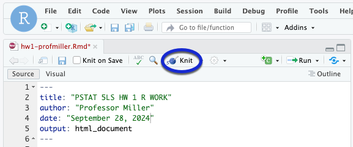

```{r setup, include=FALSE}
knitr::opts_chunk$set(echo = TRUE)
library(stats250sbi)
```

# Don't Forget to Rename your Document

To avoid your work being overwritten, **rename** this file (`hw5.Rmd`). You could add your name to the file name (e.g., `hw5-profmiller.Rmd`).

## Healthy Body Temperatures

The standard healthy human body-temperature of 98.6 degrees Fahrenheit was made famous by German physician Carl Reinhold August Wunderlich, who published the figure in a book in 1868. Modern studies, however, have called that number into question, suggesting that it's too high.

A medical research team at Stanford led by Julie Parsonnet, MD, compiled a data set of body temperature measurements from adult patients who visited Stanford Health Care between 2007 and 2017 to examine this question.[^1] In this question, we'll be looking at a randomly selected subset of 100 of those measurements. It was determined that these Stanford patients are a good representation of adults across the entire United States.

[^1]: Myroslava Protsiv, Catherine Ley, Joanna Lankester, Trevor Hastie, Julie Parsonnet (2020) Decreasing human body temperature in the United States since the Industrial Revolution eLife 9:e49555, https://doi.org/10.7554/eLife.49555

## Read in the Data

Run the code in chunk below to read in the data.

```{r readData, error = T}
bodyTemps <- read.csv("body_temp_100.csv", stringsAsFactors = TRUE)

```

## Examine a Histogram of the Temperatures

The first step in analyzing data is to make a graphical display. Use the following chunk to create a histogram of the body temperatures (`bodyTemps$temp`). Be sure to add a title and axis label. 

```{r hist, error = T}


```

## Calculate the Summary Statistics

Use the following code chunk to calculate summary statistics, including the standard deviation, for the temperatures.

```{r summary_stats, error = T}


```

## Have R Run the Hypothesis Test

Use the following code chunk to have R run the test research team’s claim that the mean body temperature for healthy humans has decreased from 98.6 degrees Fahrenheit.

```{r HT, error = T}


```


<hr />

# Wrap-Up and Submission

At the top of the document, make sure you've changed the `author` field to your name (in quotes!) and the `date` field to today's date.

When you've finished your data analysis, click the **Knit** button one last time.<br />

{width="75%"}


### Submission instructions

```{=html}
<!-- This is a comment and will not show up in your document. Note that the
numbering here is all 1's. This will automatically be converted to 1, 2, etc.
when you knit the document; writing all 1's makes it so you don't have to
constantly update the numbering when you move things around in editing! -->
```
1.  In the Files pane, check the box next to your `hw3.html`: </br>

{width="50%"}

2.  Click More → Export... </br>

{width="50%"}

</br>

3.  Click Download and save the file on your computer in a folder you'll remember and be able to find later. You can just call the file `hw3-yourname.html` or whatever else you'd like (as long as you remember what you called it).

{width="50%"}


